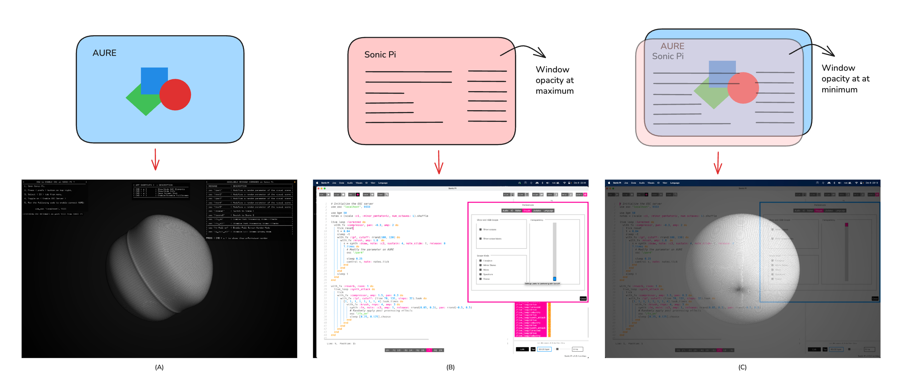
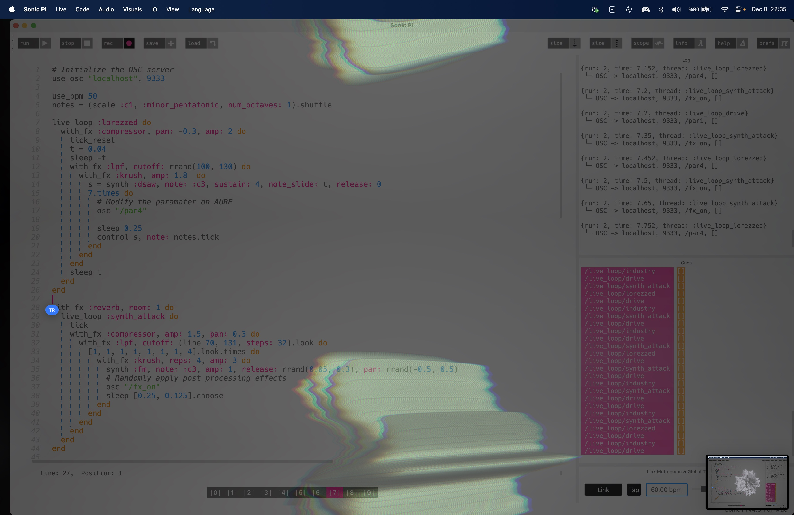

# AURE Beta (WIP)
A domain-agnostic, audio-reactive application framework designed for musical live-coding environments.

AURE is currently available only for Mac OS X systems.

# Instructions
1. Compile the app using openframeworks or download [here](https://github.com/alptugan/AURE/releases/tag/v1.0-beta) for Mac.
2. Open the AURE app and follow the instructions on startup.
3. Open Sonic Pi or any other live-coding tool capable of sending OSC
4. Set the OSC port 9333 to send messages. Run `use_osc "localhost", 9333` on Sonic Pi.
5. Use *osc "/par1"* messages to morph scene content inside `live_loops` to sync audio with generative visuals.
6. Use *osc "/fx_on"* messages to morph scene content inside `live_loops` to apply post processing effects.

# List of Available OSC Commands
You can use the following OSC messages to adjust parameters of the generative visuals on the fly.

| OSC Command | Description                                       |
| ----------- | ------------------------------------------------- |
| /par1       | Modifies a random parameter of the current scene. |
| /par2       | Modifies a random parameter of the current scene. |
| /par3       | Modifies a random parameter of the current scene. |
| /par4       | Modifies a random parameter of the current scene. |
| /par5       | Modifies a random parameter of the current scene. |
| /fx_on      | Apply a random post-processing effect.            |
| /fx_off     | Disable all post-processing effects.              |
| /w_full_on  | Enable Full Screen Window Mode                    |
| /w_full_off | Disable Full Screen Window Mode                   |
| /scene1     | Switch to Scene 1                                 |
| /scene2     | Switch to Scene 2                                 |

