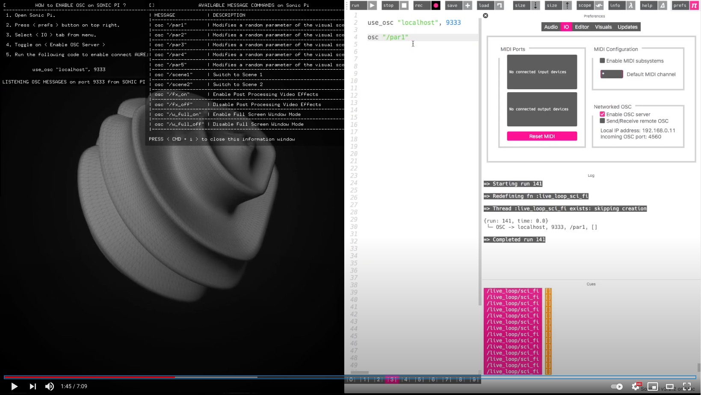

# AURE
A domain-agnostic, audio-reactive application framework designed for musical live-coding environments.

AURE is currently available only for Mac OS X systems.
The relevant addons and source files will be added soon in order to compile project successfully. 
OS X users can download prerelease version from the below link for testing purposes. 

Screen shot from AURE

# Instructions
1. Goto **Releases** Tab & Download the [beta release](https://github.com/alptugan/AURE/releases/tag/v0.2-beta).
2. Extract the zip file to your preferred file location.
3. Double-click & run.
4. Follow the screen instruction on top-left corner.
5. For further information and tutorials go to following links for tutorials;
   -   https://youtu.be/aaX35AG2F0E
   -   https://youtu.be/Ls-0NSt6PM0
