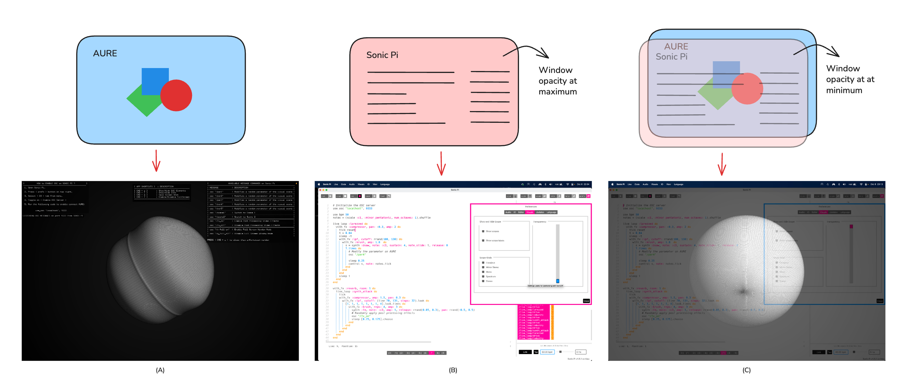
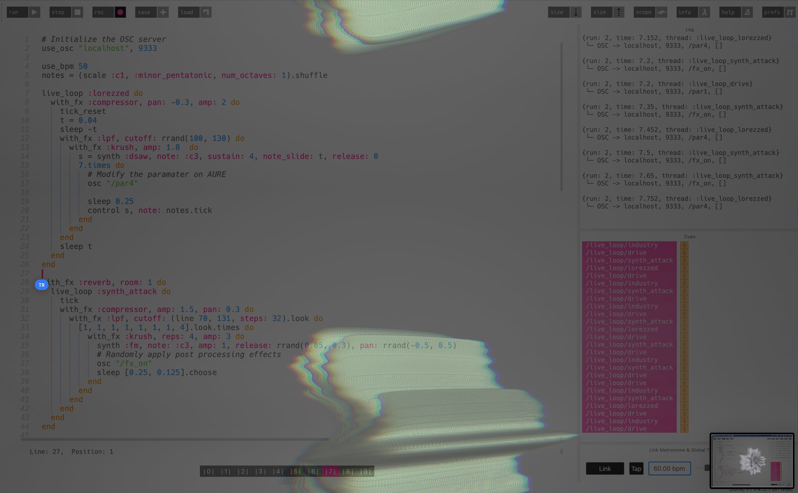

# AURE Beta (WIP) - User's Guide
A domain-agnostic, open-source, audio-reactive application framework designed for musical live-coding environments. The source code is available at [Github/alptugan](https://github.com/alptugan/AURE). AURE is currently available as standalone app for only Mac OS X systems. Since it was built with the creative `C++` coding framework [openFrameworks](https://openframeworks.cc/), you can compile the source-code relevant to your operating system.

**Setup Diagram with Sonic Pi**

**Actual setup with Sonic Pi**

## Add New Scenes
Developers interested in extending the application with additional scenes should consult the [developer documentation](docs/DEVELOPER_GUIDE.md).

## Instructions
1. Compile the app using openframeworks or download [here](https://github.com/alptugan/AURE/releases/tag/v1.0-beta) for Mac. If your system rejects to open AURE. Follow the [instructions](https://github.com/alptugan/icns-creator#option-2-without-disabling-the-gate-keeper) or ask it to an LLM for the instructions.
2. Open the AURE app and follow the instructions on startup.
3. Open Sonic Pi or any other live-coding tool capable of sending OSC
4. Set the OSC port 9333 to send messages. Run `use_osc "localhost", 9333` on Sonic Pi.
5. Use *osc "/par1"* messages to morph scene content inside `live_loops` to sync audio with generative visuals. Refer to "List of Available OSC Commands" section.
6. Use *osc "/fx_on"* messages to morph scene content inside `live_loops` to apply post processing effects.

## List of Available OSC Commands
You can use the following OSC messages to adjust parameters of the generative visuals on the fly.

| OSC Command | Description                                       |
| ----------- | ------------------------------------------------- |
| /par1       | Modifies a random parameter of the current scene. |
| /par2       | Modifies a random parameter of the current scene. |
| /par3       | Modifies a random parameter of the current scene. |
| /par4       | Modifies a random parameter of the current scene. |
| /par5       | Modifies a random parameter of the current scene. |
| /fx_on      | Apply a random post-processing effect.            |
| /fx_off     | Disable all post-processing effects.              |
| /w_full_on  | Enable Full Screen Window Mode                    |
| /w_full_off | Disable Full Screen Window Mode                   |
| /scene1     | Switch to Scene 1                                 |
| /scene2     | Switch to Scene 2                                 |

### Control & OSC Reference
- **Scene Switching:**
  - **Keyboard:** Keys `1` to `9` switch directly to scenes `0` to `8`.
  - **OSC:** `/scene1`, `/scene2`, `/scene3`, `/scene4`, etc. switch automatically.
- **Scene Parameters (OSC):**
  - `/par1` to `/par5` call `onPar1()` to `onPar5()` on the active scene.
  - `/reset` calls `onReset()` on the active scene.
- **FX & Window (OSC):**
  - `/fx_on` / `/fx_off`: Trigger or disable post-processing shaders.
  - `/w_full_on` / `/w_full_off`: Toggle fullscreen mode.

## Dependencies
- **openFrameworks** `v0.12.0+`
- [ofxContentsManager](https://github.com/alptugan/ofxContentsManager)
- [ofxDaseinCosmos](https://github.com/alptugan/ofxDaseinCosmos)
- [ofxEasing](https://github.com/funatsufumiya/ofxEasing)
- [ofxPostProcessing](https://github.com/alptugan/ofxPostProcessing)
- [ofxTweenzor](https://github.com/NickHardeman/ofxTweenzor)
- ofxGui (core version)
- ofxOsc (core version)
